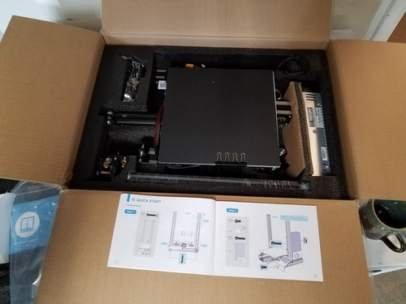
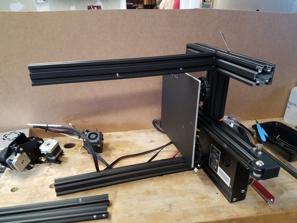
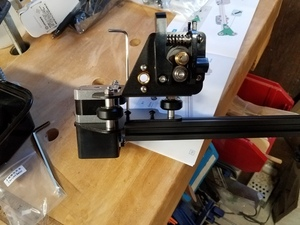
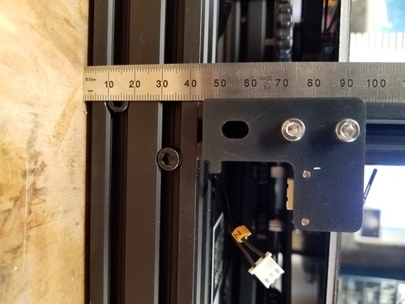
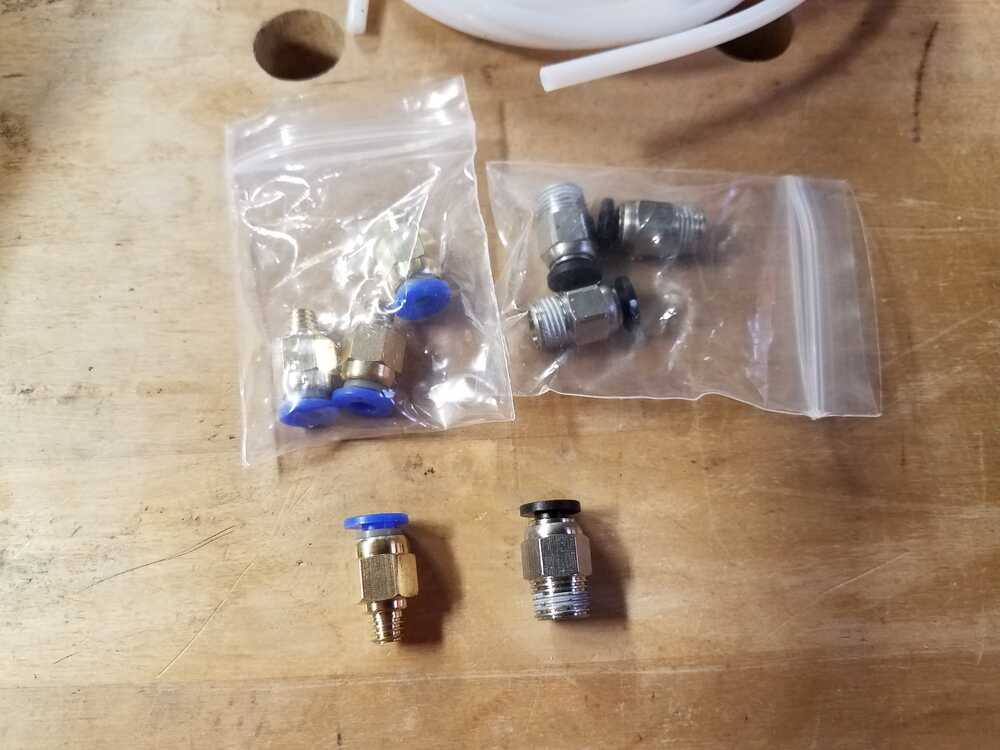
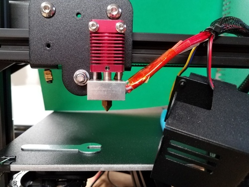
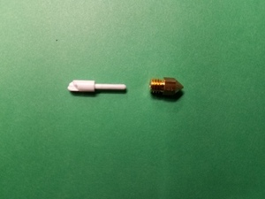

# Machine Class stuff 2021

### Jan 15

Received Ender3.

**Build notes.**

Below are some pictures.  Top layer of box as received.  After placing uprights.  Detail of xbeam assembly.  z-limit switch placement.

For the initial build, I used the documentation in the booklet that came in the box.  Took about 1.5 hours for assembly.  A build video [here](https://www.youtube.com/watch?v=me8Qrwh907Q&feature=emb_title) is very well done. one good approach would be to watch the video first.  Of course, I put it together first, and then watched the video. For those who are more cautious,
 the build video could be followed with good results. Once I got the machine together, and printed a first part, I took it apart and re-assembled, being more careful in places.  Below are notes from the builds: 

  * After the initial assembly, I found that the filament tubing did not get captured by the fitting on the extruder.  As far as I can tell, neither coupler that came with the printer works.  I ordered a set of replacements from Amazon.   [Amazon link to replacement parts](https://amzn.to/2JXDcvX)  
These work better.  I also replaced the hot end connector with one from the Amazon package.  Both seem of better quality.
Below is a picture of the connectors received.  

  * Tighten nuts on roller assembly, and adjust eccentric nuts to proper tension to take wobble out of plate.  This is easiest to do before assembling.
  * Square uprights before tightening nuts completely.
  * Adjust all rollers on extrusions before assembling.  (eccentric nuts again).
  * Suggests replacing cable ties around wire bundle to make less tight. 
   
 [video](https://www.youtube.com/watch?v=GsEdU8ZtI6U) gives a good explanation of these nuts.

* Issues on getting hot end clogged and gap between tube and nozzle, related to poor quaility couplers. [Video here](https://www.youtube.com/watch?v=30qqKUwviww)

