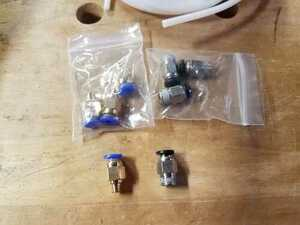
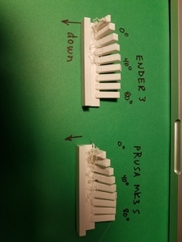

h Machine Class stuff 2021

### Jan 15

Received Ender3.

**Build notes.**

Below are some pictures.  Top layer of box as received.  After placing uprights.  Detail of xbeam assembly.  z-limit switch placement.

For the initial build, I used the instructions in the booklet that came in the box.  Took about 1.5 hours for assembly.  A build video [here](https://www.youtube.com/watch?v=me8Qrwh907Q&feature=emb_title) is very well done. I put it together first, and then watched the video. For those so  
 inclined, the build video could be followed with good results.  After the initial assembly, I found that the filament tubing did not get captured by the fitting on the extruder.  As far as I can tell, neither coupler that came with the printer works.  I ordered a set of replacements from Amazon.   [Amazon link to replacement parts](https://amzn.to/2JXDcvX)   

These work better.  I also replaced the hot end connector with one from the Amazon package.  Both seem of better quality.
Above is a picture of the connectors received. A roll of PTFE tubing is included.  We should probably order a bunch of these, and have students build with the better fittings.  In the Creality hotend design, the PTFE tube goes all the way to the nozzle.  The tubing connector needs to work in order for there not to be a gap between tube and hot nozzle.   [Here is a video](https://www.youtube.com/watch?v=30qqKUwviww) that shows how to unclog the hot end when filament gets bunched up at the nozzle.  Below are pictures of the hot end with the shroud removed, and a filament that experienced a gap between tube and nozzle. (ie, the filament was pushed in without the tube in place!)

Once I got the machine together, and printed a first part, I took it apart and re-assembled, being more careful in places. Documents on the SD card that comes in the box also have the assembly instructions, with more details.  [Here](ender3_assy.pdf) is the pdf.
 Below are notes from both builds: 

  *  
  * Tighten nuts on roller assembly, and adjust eccentric nuts to proper tension to take wobble out of plate.  This is easiest to do before assembling.   [video](https://www.youtube.com/watch?v=GsEdU8ZtI6U) gives a good explanation of these nuts.
  * Square uprights before tightening nuts completely.
  * Adjust all rollers on extrusions before assembling.  (eccentric nuts again).
  * Suggests replacing cable ties around wire bundle to make less tight. 
  * bed levelling [video](https://www.youtube.com/watch?v=5eqTmb01cBk) 

* Issues on getting hot end clogged and gap between tube and nozzle, related to poor quaility couplers.

Evaluation.

