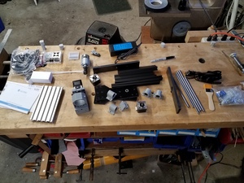
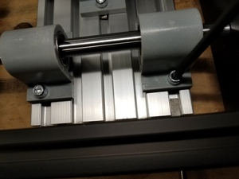
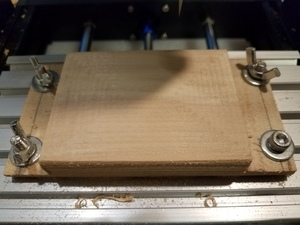
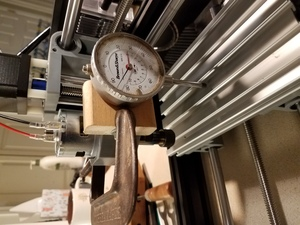
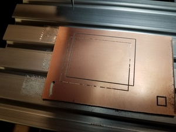
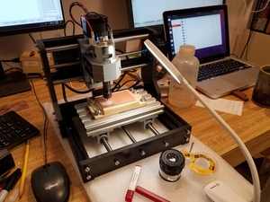
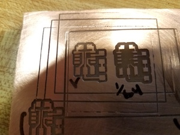
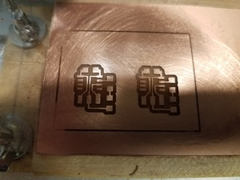

##Notes on GENMITSU CNC machine.

**Assembly**

![picture of parts on bench]

* Hardware part count seems reasonably small - good job.
* Start 2PM
* Attach plate to four linear bearings and leadscrew nut.  Channel nuts can be made to go perpendicular with a little help from a screwdriver.

* Don't worry much about six channel nuts.  They seem to turn enough, and can't get to them anyway.
* When attaching lead screw, attach coupler to stepper, in a way that setscrews can be adjusted, then insert leadscrew.  Then assemble the rest, letting the leadscrew go through the bearing at its non-powered end.
* Completed and Ubiety 3:30 PM.  (Ubiety: the quality or state of being in a place: such as. a : the state of being placed in a definite local relation : position, location. b : the abstract quality of being in position). 
* Had to drill out control board acrylic holes to 5.2mm to clear 5mm screws.

1/29/21

Got machine running with Candle software and with offline controller.  All looks good.  

Tutorial [here](https://docs.sainsmart.com/article/imvlf0s7un-intro-to-cnc-for-a-total-novice) that introduces control of machine with provided software and files.

* Can control with GUI controls. All is well.
* Can load a gcode file from the USB drive provided in the kit.  It workds.
* Can type gcode commands in the Console and get reponse.

2/3/29

Used dial indicator clamped to z spindle carriage.  As carriage translates, there is about .005"(0.13 mm) deviation in z over 100mm x-travel (bed movement) and 0.001" (0.025 mm) in 40mm y travel.  That is, bed rises relative to spindle as x increases.  I tried to loosen and tighten screws to twist it into alignment, but could not change it easily.  Still, could probably cut a circuit right in the bed.

Check z-travel: 5 mm is 0.197" (actual 0.1969").  Good enough.
Useful machining volume with 3mm shaft conical bit is about: x:150mm, y:100mm, z:25mm.  Actual total travel of z-carriage is 45mm, so potential to increase useable range.

2/5/21

Cut a 40x30mm rectangle single pass to check PCB trace potential.  Tape copper-clad board to aluminum bed.  
Created g-code with mods, using 0.10mm default depth of cut.

Mill bits:  These are all 0.125" (3.14 mm or so).

* 10 conical half-bits included with kit.
* a bunch with varying angle, all half/conical from the 863.20 kit.
* some 1/6,1/32, 1/64 carbide depot bits.

Started with a bit from the Sainsmart kit, and destroyed it by forgeting to zero Z.
  Then used one of the smaller angles from the 863 kit.  Cut 0.4mm wide channel that looks nice, but with copper left at the bottom.  The pattern does not indicate a systematic slope to the board.  Then moved z down by 0.05, and cut a 0.5 mm wide tace, not looking as clean, but all the way to bottom. 

Next, install one of the "sharpest" of the 863.20 set of bits.  Zero with plastic shimstock 0.002", run rectangle job. This time, the board was not level enough to make a consistent channel.  Looks like depth varied by ~ 25 microns over the 40 mm board.  

2/5/21

Installed and levelled a wood (solid piece of hardwood - birch?) block sac layer (65x85 mm). Used mods PCB program.  The path left a piece of wood in the middle - why?  G-code generated F=150 mm/min feedrate works OK with single flute 1/8" endmill, cutting 1.5mm depth.  Endmill shaft was long enough that I had to cheat by 1 mm in z-zeroing, and program 0.5 mm to cut 1.5 mm.  Was able to use console to machine off the last bit of the bed.  Nice.

Now I'm able to get a pretty good 0.3 mm channel, with a conical bit, with some rough edges, but most copper removed around a 30x40 mm rectangle.  Ran gcode for the tiny412 hello-world.  

* conical bit did well. Channel width 0.3-0.5 mm.  PCB traces all nice and thick.
* 1/64 endmill did well, although lines are a bit messier and more copper is removed.
* 1/64 endmill produced a single pass width of 0.4  mm.  Runout is not apparent.

Pictures below show rectangle cut to test bed leveling (not so good), PCB mounted on sacricifial board, PCB cut with V-bit and a bad endmill, and two sets of traces cut with better 1/64" endmill. PCB did not adhere well to board.  Need a different sublayer. Here is a [link](./rect01.png.nc) to the g-code file for the rectangle.
 

#### General comments on using the mill

* I like the fact that it is physically open and accessible. Easy to change bits and manipulate obects on the table.  
* I'm happy with the Candle interface.  Moving the head around is easy, zeroing is easy.  G-code interface is clear, can edit g-code on the fly.  Can send commands from terminal. The visualization of tool and job is useful and easy. I really like the ability to see tool placement relative to job, and to monitor progress.  The navigation is good, with speed changes and increment changes.  This makes zeroing easy.
* g-code from mods runs mostly OK.  It does not like '%' at file start, or 'T1M06'.  With those removed, runs OK.
* Kit is lacking in tie-down hardware.  We'll want to at least include more 5mm hardware, and maybe a supplemental kit, like [this one](https://www.amazon.com/Genmitsu-Compatible-3018-PRO-3018-MX3-3018-PROVer/dp/B08H5K2VVK/ref=asc_df_B08H5K2VVK/?tag=hyprod-20&linkCode=df0&hvadid=466581293426&hvpos=&hvnetw=g&hvrand=6853096103172684647&hvpone=&hvptwo=&hvqmt=&hvdev=c&hvdvcmdl=&hvlocint=&hvlocphy=9002075&hvtargid=pla-961712410533&psc=1).
* This machine can be used to cut PCB's and other 2D stuff.  Cutting in z limited to about 25 mm as currently configured.  

