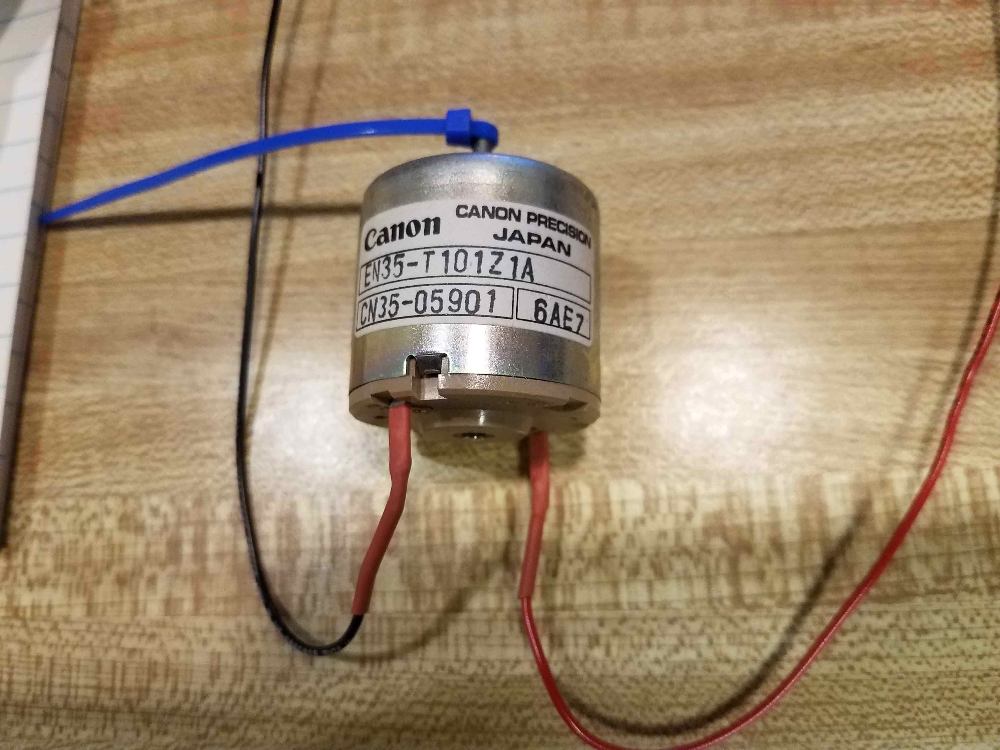
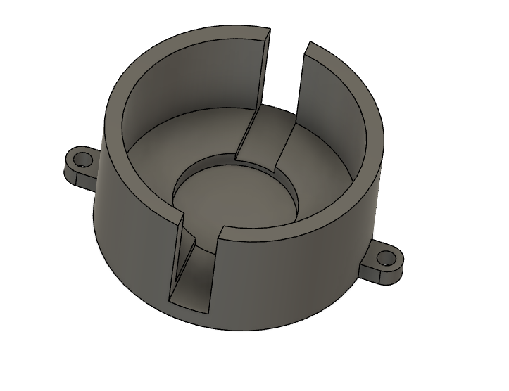
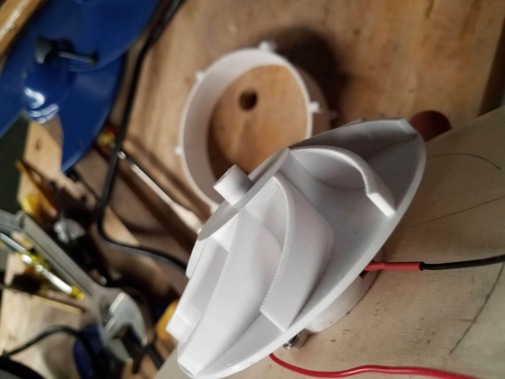
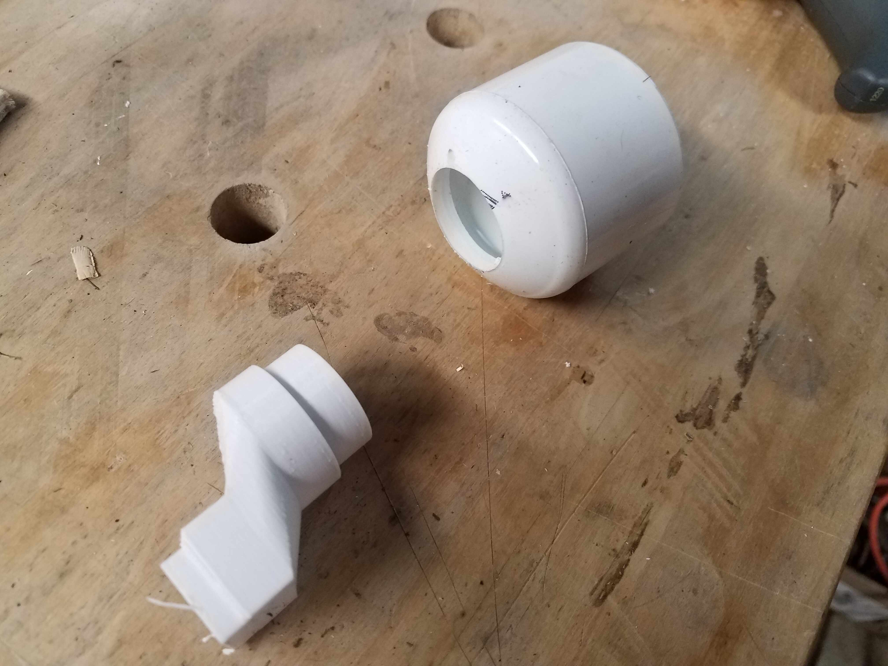
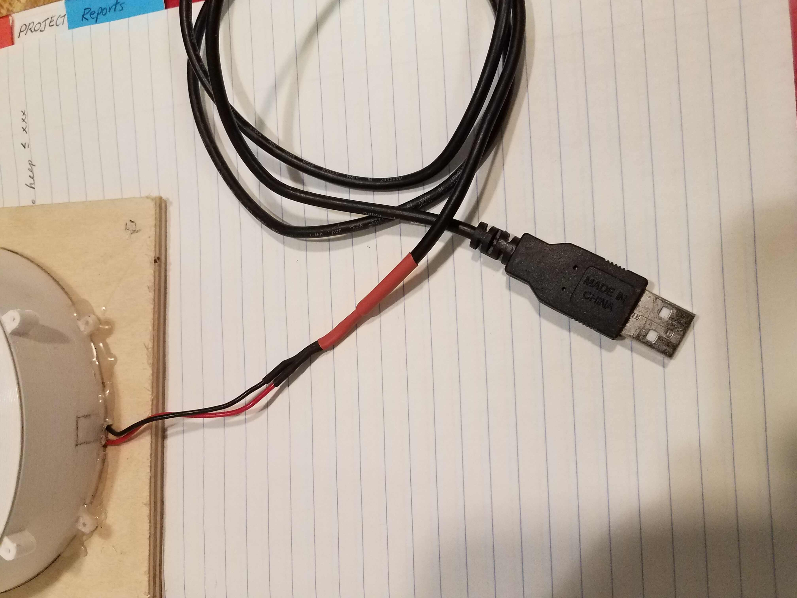
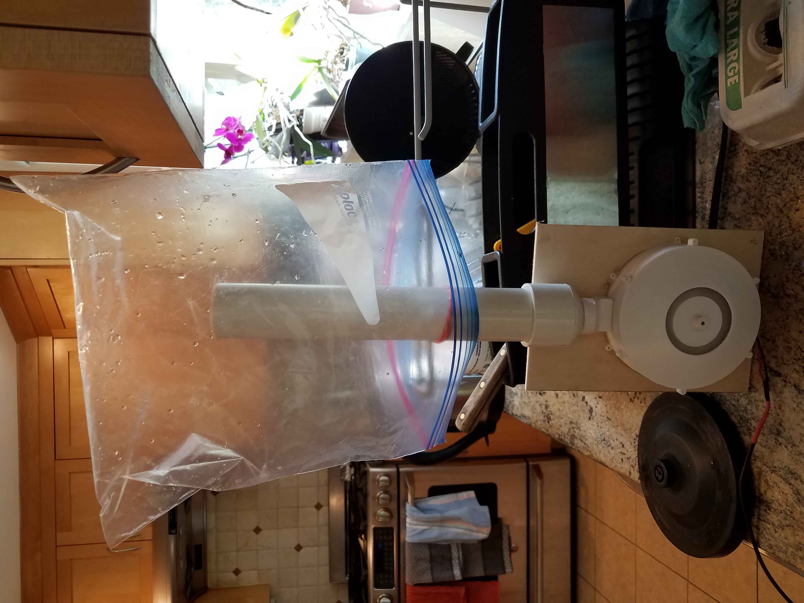

# Air pump for bag drying. 

### First version

I found a 120V fan that plugs into the wall.  It pushes a lot of air, and is very noisy.  Bags fly all over the place.....  Need a quieter, small fan.

### Sketches and design of air pump.

I made a series of concept sketches, thinking about the motor that I would use, and how to interface the output with a useful tube. In this process, I figured out what parts would be designed, and how they would attach to a plywood base.  I tried to keep it modular, with the parts as simple as possible.  
 

The motor that I want to use is a DC motor from Canon.  These are still available online for a few dollars.  I found a bunch for 1$ a couple years ago, and only bought 100. To find these, search for "canon motor EN35".  
 

Then I sat down with ruler and made a sketch that had some of the relevant dimensions, so that I could design it in CAD.

First version of the rotor in CAD.  After the first try, I had a rotor with diameter of 130 mm.  Only when I saw the outline on the 3D printer bed, did I realize that this was bigger than I wanted.  Went back, and designed the rotor pictured below, about 100 mm in diameter.  Also pictured: a motor holder and an adapter for the output.

All files are in the repository in the 'cad' directory.  Stl files in the 'stl' directory.

Here's the rotor attached to the motor, both mounted to a board.  Then placed into volute and covered with the cap.

A PVC pipe fitting was drilled to match the adapter.  (The adapter was a fun part to design)

It turned out that 5 volts powered the pump well enough to get a bit of airflow while keeping the whole thing pretty quiet.  The motor draws about 0.06 amps at that voltage.  The motor leads were soldered to a USB cable. 

And the whole thing hot-glued together to try out.  A usb power pack should be able to run this for hours.  The flow is great enough to dry a bag in ~15 minutes.  Almost useful!

### Next steps.

  * Make a version with:
    * proper hardware for fastening and better joining of parts.
    * More flow area in the same volume for more flow at same speed.
    * Built-in micro USB connector.
  
  * lklkjlkj
    * kjlkj
    * lkjlkj

