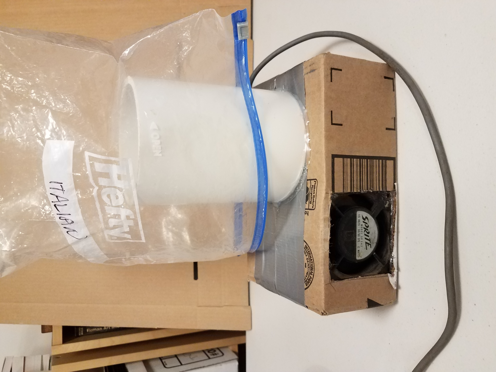
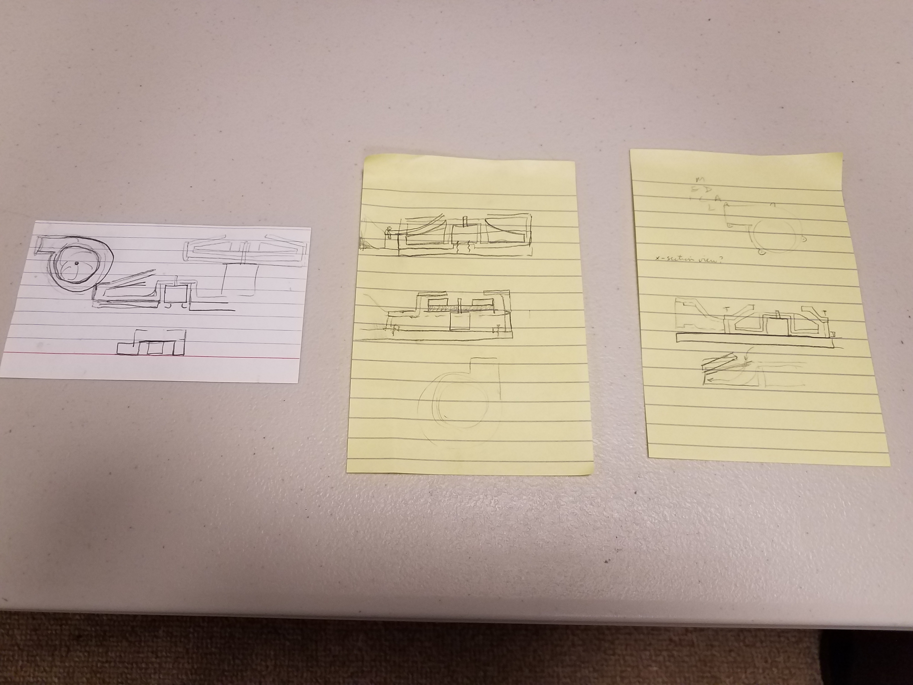
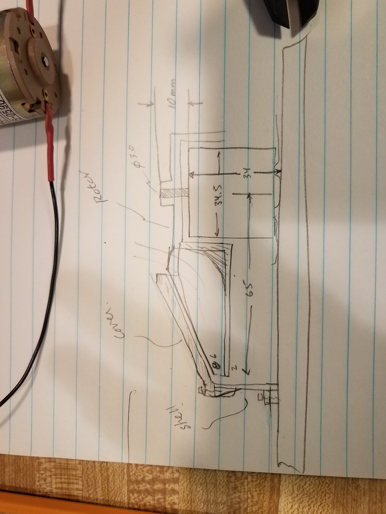

# Air pump for bag drying. 

### First version

I found a 120V fan that plugs into the wall.  It pushes a lot of air, and is very noisy.  Bags fly all over the place.....  Need a quieter, small fan.

### Sketches and design of air pump.

I made a series of concept sketches, thinking about the motor that I would use, and how to interface the output with a useful tube. In this process, I figured out what parts would be designed, and how they would attach to a plywood base.  I tried to keep it modular, with the parts as simple as possible.  
 
 

Then I sat down with ruler and made a sketch that had some of the relevant dimensions, so that I could design it in CAD.

 

First version of the rotor in CAD.  After the first try, I had a rotor with diameter of 130 mm.  Only when I saw the outline on the 3D printer bed, did I realize that this was bigger than I wanted.  Went back, and designed the rotor pictured below:

 
