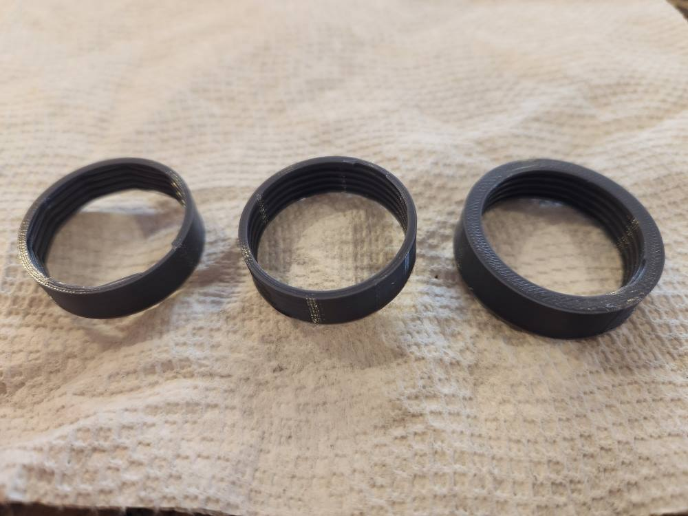
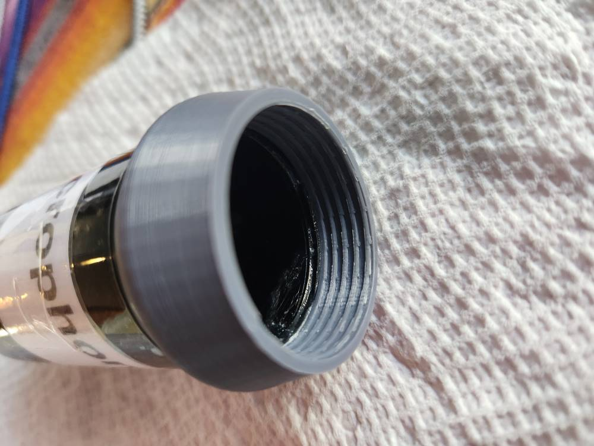
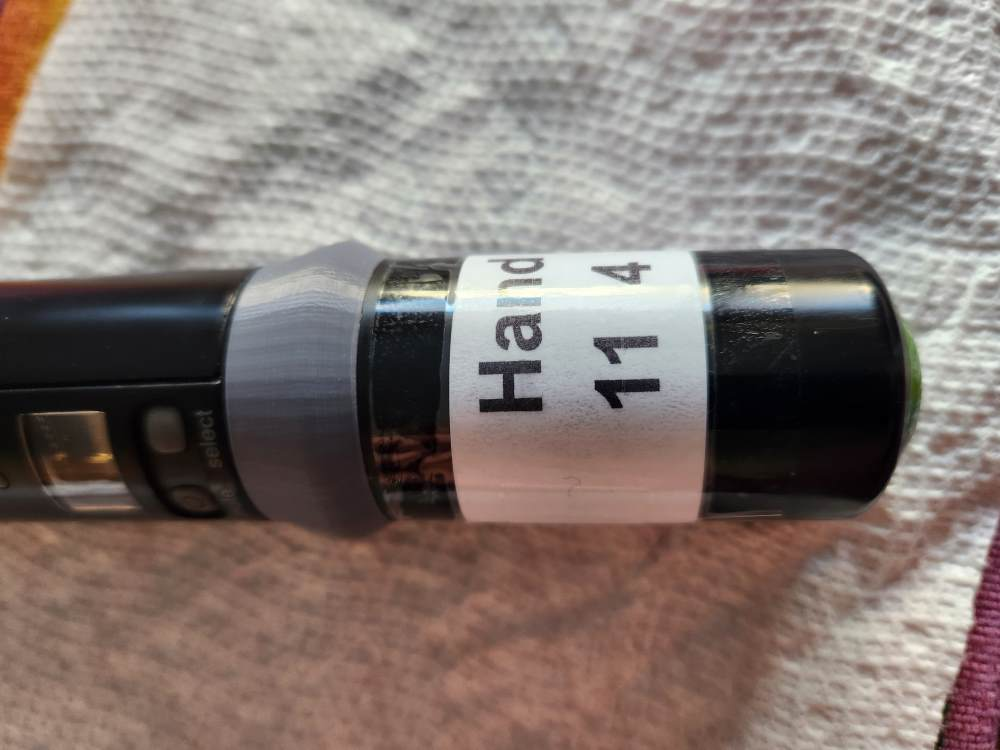

# Microphone repair

Repair of hand mics for COS.  

[Onshape link](./food_proc_001.FCStd)

January 2025.  [Onshape link](https://cad.onshape.com/documents/7cac0a776679c915837c0d72/w/f828bc012e23bbfdf6c51e41/e/65efa01582cbad1994072245)

First, design threads and adjust until it fits:

Then add material to allow gluing of existing part, minus the threads.  Print final part on Prusa MK3S with PLA, using 0.1mm Detail setting.  

