### Color Clock

Stephen Bates.

| | | |
|---|---|---|
| 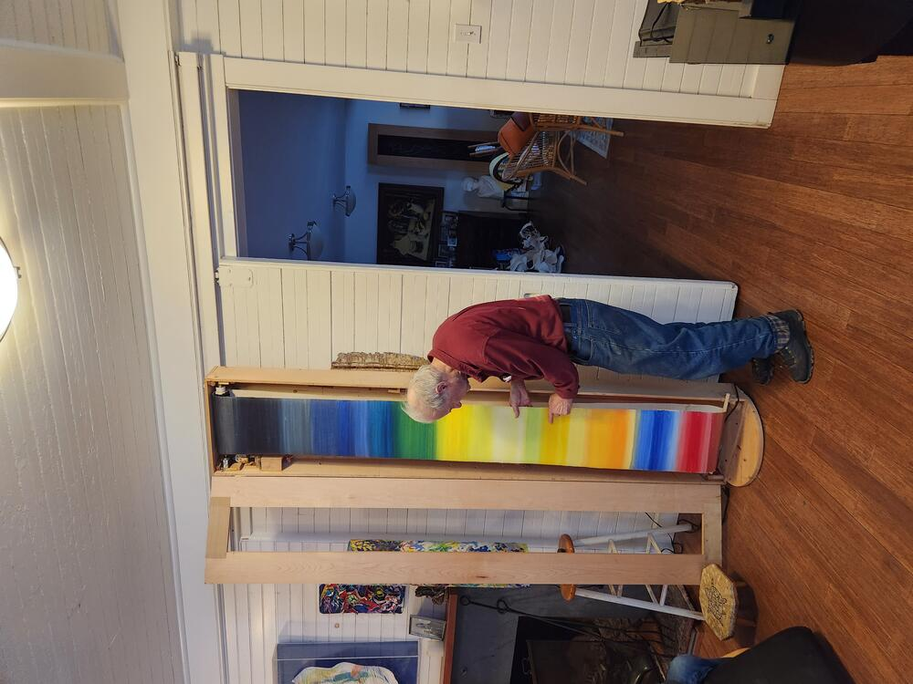 | 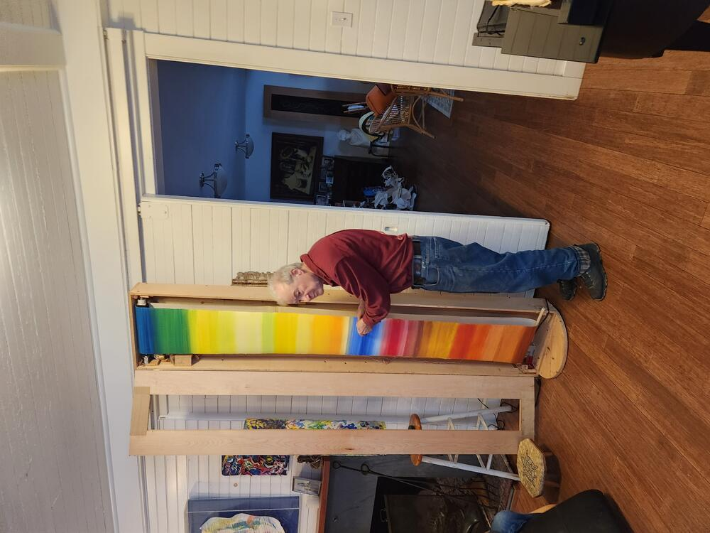 | 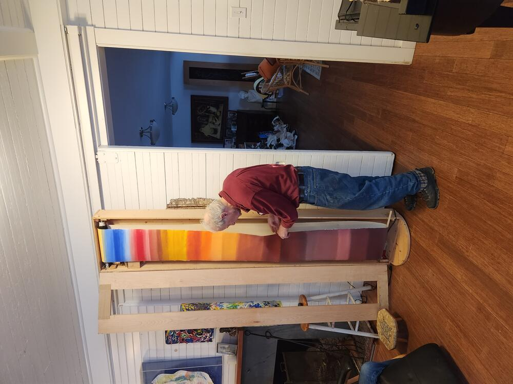 |

Below is documentation.  Step files for all parts are in 'mechanical' folder here.  Micropython code for the RP2040 microcontroller on the stepper module board is in 'code' folder.  

PLA parts to position the stepper motor.  Slots allow adjustment in two directions.  Captured nuts for connecting parts and attaching spindle to motor shaft.  

| | | | |
|---|---|---|---|
| 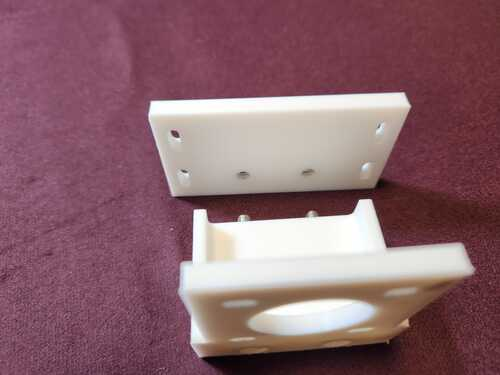 | 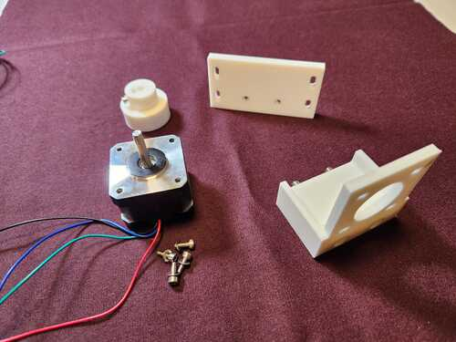 | 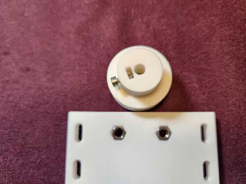 | 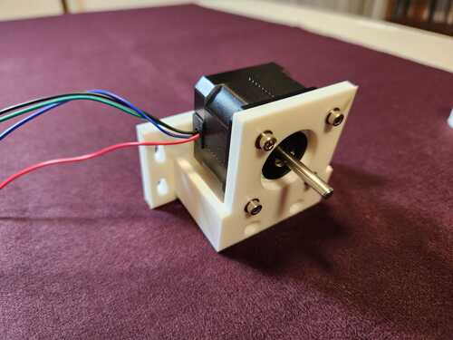  |

Electronics for the stepper are on a modular board from the CBA at MIT.   The modular board is documented [here](https://github.com/modular-things/modular-things/tree/main/things/stepper-hbridge-xiao). The board fits into a 3D printed case.  An OLED is used for display, and buttons change the stepper period.  First prototype shown below, in which a breadboard with messy wires is used to develop software.

| | | | 
|:---:|:---:|:---:|
| 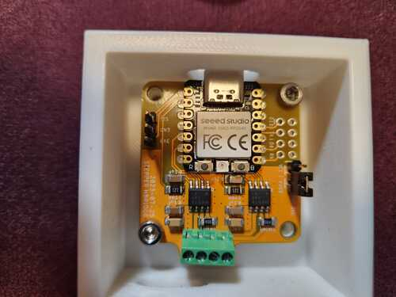 |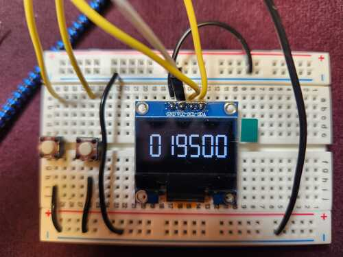 | 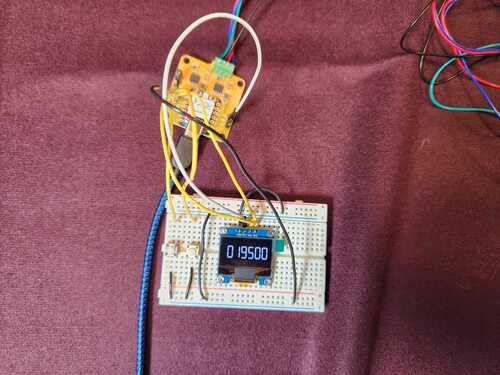 |
| Electronics case | Motor holder | OLED on breadboard | Wiring mess |

Placing parts in case, and soldering connections.  A ribbon cable connects pins of microcontroller with the OLED and buttons.  OLED fits into the lid of the box.    

| | | |
|---|---|---|
| 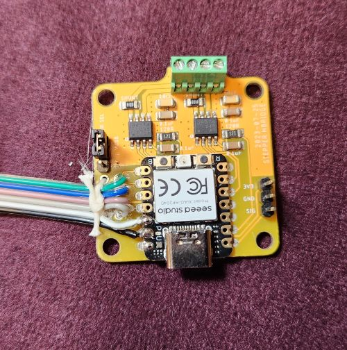 | 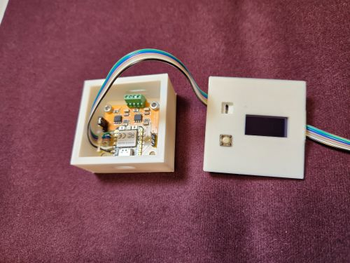 |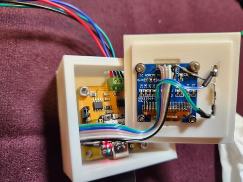 |
| Stepper module| Electronics case | Case connections |

The parts all together and ready to install are below.
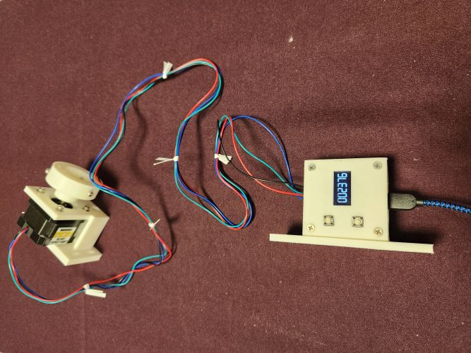

