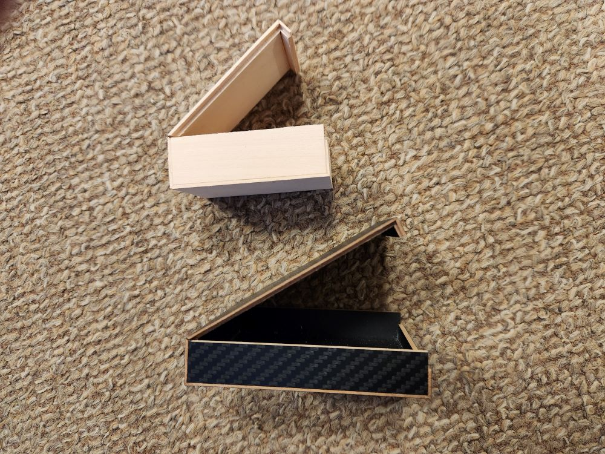
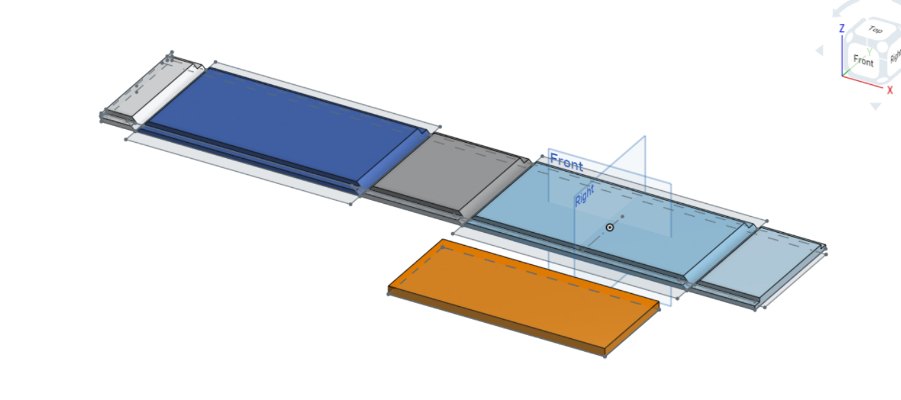
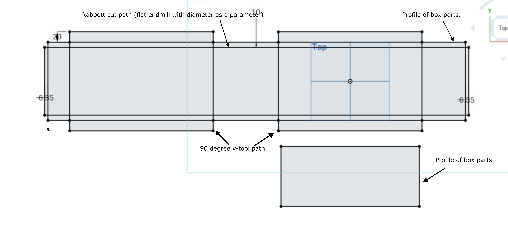
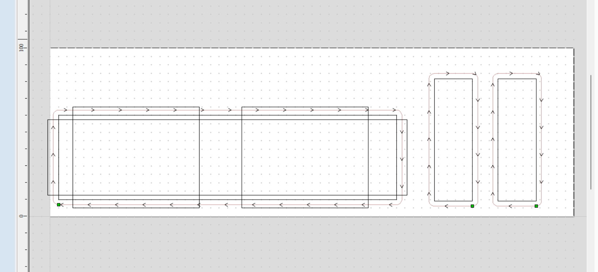

## Parametric box	

The little black box that appeared in the lab in 2023 inspired this project.  This is a design for a parametric box cut on the shopbot.  Two kinds of cuts are made:  a v-bit cut at 90 degrees to make the hinges, and a cut with a straight endmill to make the rabbet cuts for the side panels and to cut out the parts.

Parameters are:  Three box outer dimensions, stock thickness, and the diameter of the straight endmill.  The design is made in Onshape, and can be found [here.](https://cad.onshape.com/documents/c429adf695cccbb3df6ce57b/w/f26c7c8d38f2610c9769fc54/e/f1eba46c150b72f9fee9967c)

From Onshape, a dxf is exported from one of the sketches, including just the lines needed for the cuts.  

Import the DXF into the shopbot software (aspire or v-carve), close the vectors, and define three toolpaths:  
 - v-bit toolpath on two rectangles.
 - rabbet toolpath
 - profile toolpath		

Use python to generate parameter-based toolpaths.

