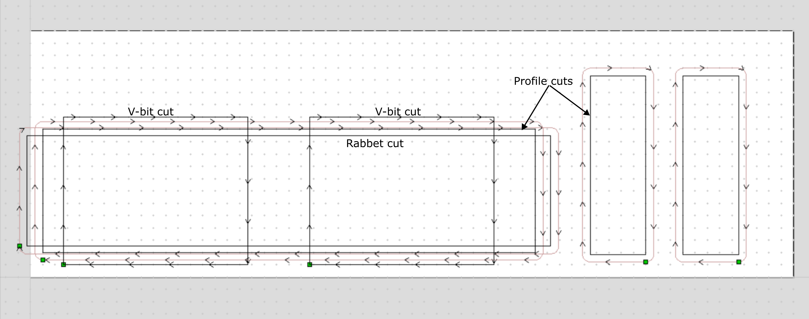

## Parametric box

### Defining in parametric CAD and exporting DXF to shopbot toolpathing software.	

The little black box that appeared in the lab in 2023 inspired this project.  This is a design for a parametric box cut on the shopbot.  Two kinds of cuts are made:  a v-bit cut at 90 degrees to make the hinges, and a cut with a straight endmill to make the rabbet cuts for the side panels and to cut out the parts.

Parameters are:  Three box outer dimensions, stock thickness, and the diameter of the straight endmill.  The design is made in Onshape, and can be found [here.](https://cad.onshape.com/documents/c429adf695cccbb3df6ce57b/w/f26c7c8d38f2610c9769fc54/e/f1eba46c150b72f9fee9967c)

From Onshape, a dxf is exported from one of the sketches, including just the lines needed for the cuts.  

Import the DXF into the shopbot software (aspire or v-carve), close the vectors, and define three toolpaths:  
 - v-bit toolpath on two rectangles.
 - rabbet toolpath
 - profile toolpath		

For precision, it may be good to add a partial sacrificial layer and level it with the large facing bit.  After levelling, attach stock.  I used the blue tape trick that I learned frok Dave Priess at CBA/MIT:  Blue masking tape adhesive side against both stock and bed.  Then attach with superglue between the tape backs.  This way, the tape peels well off of both box and bed, but holds well enough to machine.

Glueing.  If you leave the tape attached, you can glue most parts in one step.

### Next steps.

Use Python to generate parameter-based toolpaths directly.

