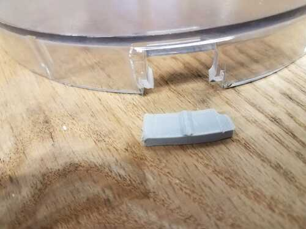
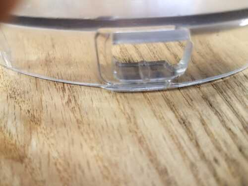

# Food processor repair

January 2021.  Part designed in FreeCad.  [Freecad file](./food_proc_001.FCStd)

Other files are in this folder:  stl, Prusa project, Prusa g-code.

Jan 28, 2021

FreeCad part fit well, but needs more glue area to stick, also needs to be amm thinner.  Decided that FreeCad and I are not yet functional.  Moved back to Fusion for the new part.  In Fusion, I can make a complex sketch and choose parts to extrude.  This is not possible in FreeCad.  Also, FreeCad's rules about where to put sketches and how to associated sketches with opbjects are not yet clear to me.  

[Link to fusion file](./Food_proc_partv2.f3d)

Printed this part on the Ender-3, using 250 Celcius for the nozzle temp.  Better adhesion than at 240, I think.

