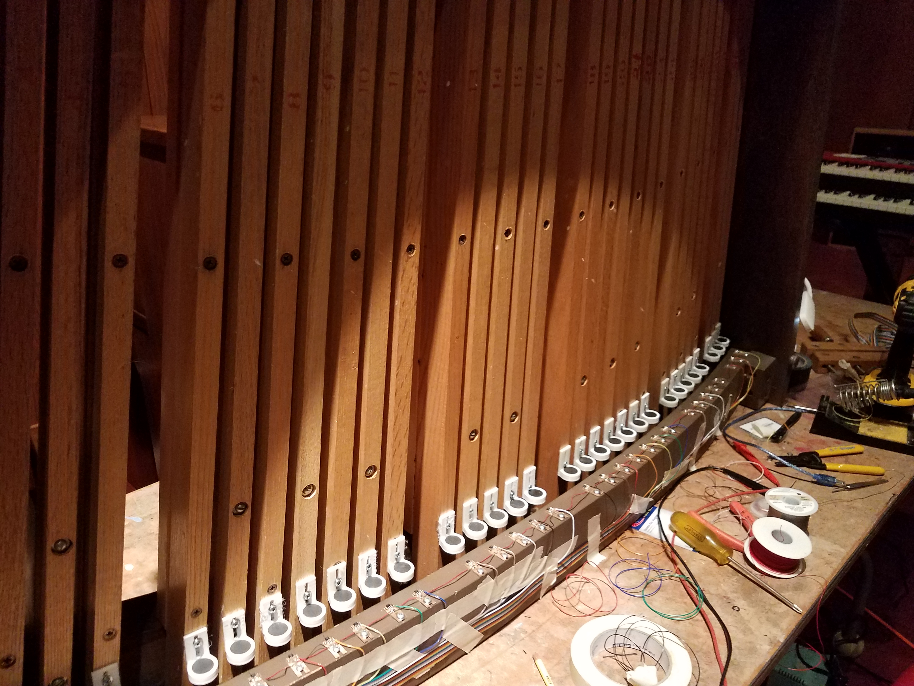

## Notes on Virtual Organ project at COS.

Here's a sketch of the Virtual organ setup.  We will use existing speakers and amplifiers without disturbing the current Rodgers organ.  Keyboards and pedals are on loan from Casey.

Rob and Casey are adding sensors and magnets to "MIDI-fy" a pedalboard that Casey brought in.

The plan is to demonstrate the virtual organ sound using this set of components.  If we think that this is a viable solution for us, we will propose a more permanent arrangement that will look and act more like a "real" organ.
